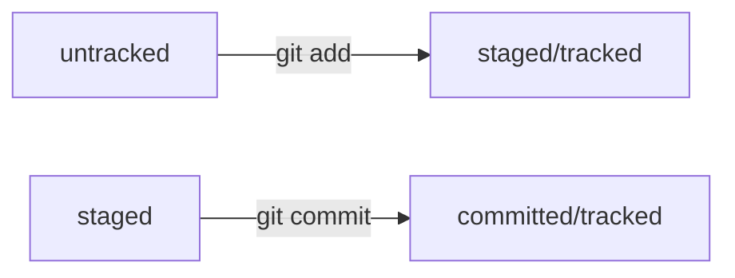

# HOW TO WORK with GIT

---

## List of useful commands:


- __git init__ _local repository initiation_
- __rm -rf .git__ _to ungit the folder_
- **git status**
- **git add** (+ file name OR flag _--all_ OR .(_"current folder"_))
- **git commit -m 'msg'**
- **git log** _to check history of commits_
- **git remote add** (+ 2 parameters: name of the remote repository AND its URL) _to bend local and remote repositories_
- **git remote -v** _to check the connection between local and remote repositories_
- **git push** _to send changes to remote repository_

In case it's the first time: 

``` bash
git push -u origin main
```
[Link to Yandex Practicum training on GIT basics](https://practicum.yandex.ru/profile/git-basics/ "I am Yandex")

## Hash of a commit


GIT hash information about a commit (time, author, files' content at the moment of the commit and a link to a parent commit) using SHA-1 algorithm.
Each commit has its own unique hash (40-character line) - Commit's main identifier.


- __git log --oneline__ - to get a shortcut log with abbreviated 7-digit hash versions (they also could be used as links to the commits)


## HEAD
- Among other files in the .git folder there is a HEAD service file. It points to the most recent commit.
- Instead of the hash of the last commit, you can write the word HEAD - Git will understand you.

## Files' statuses in GIT

- __untracked / tracked__
- __staged__ (Files in *staging area / cash / index*)
- __modified__

HEAD -- это голова.
Коммит -- это всему голова.
Статусы файлов:





In case of any changes made in tracked file:


